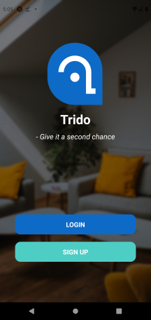
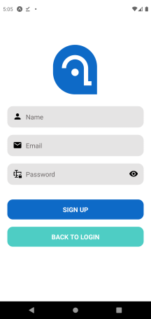
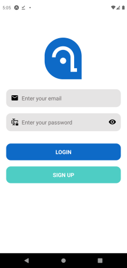
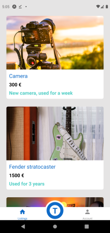
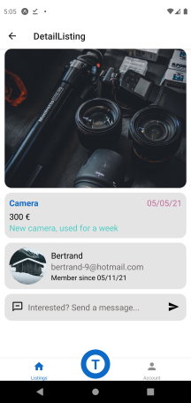
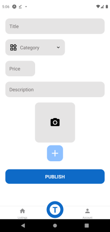
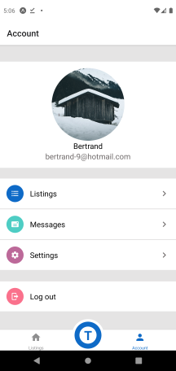
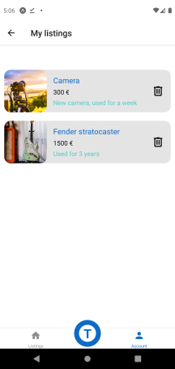

# Trido

Trido offers a second life to your old or unused objects. With all the object around the house is hard to find a use for all of them, but instead of throwing them away, try Trido first!

Users can easily publish new listing through the simple UI and get in touch whenever someone is interested with the object.

## Technologies

All the backend is hosted on Firebase

Authentification through Firebase

Listings and Users in Firestore

Images in Storage

## Librairies

Formik for the form and Yup as schema
validator

@expo/vector-icons

@expo-image-picker

@react-navigation/native => Bottom-tab and stack

@react-native-community/viewpager

## Functionalities

- Login / Register / Log out
- Publish an advert (data validation)
- Feed with all the ads, possibilty to have detailed view.
- Personalize profile picture
- See my listings and possibility to delete

## App Overview
### Welcome screen  

### Sign up screen  

### Login screen  

### Feed screen  

### Detail screen  

### Publish screen  

### Account screen  

### MyListing screen  

